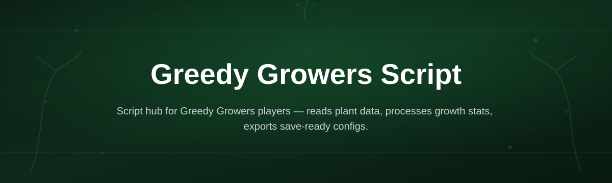
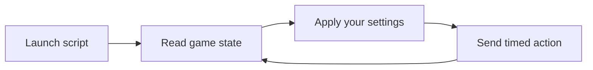

# greedy-growers-script-hub

*A lightweight companion tool for Greedy Growers players who want faster, cleaner in-game automation without touching a single line of code.*

## What this is NOT

This is not a mod loader, not a game modification, and not something that edits your save files behind your back. It doesn't require Python, Node, Visual Studio, or any build step. There's no command line to learn and no dependencies to install before you can use it.

What it actually is: a standalone Windows utility built specifically around Greedy Growers Script, the small automation layer that players use to handle repetitive tasks — planting cycles, harvest timing, resource queues — inside the Greedy Growers gameplay loop. You download one file, run it, and it does its job.

## What this is

Greedy Growers Script started as a personal fix for one problem: the game's core loop rewards patience, but patience is exactly what most players run out of after the tenth planting cycle. This project packages that automation logic into a single, self-contained tool so anyone can pick it up without reading source code or configuring anything.

The hub itself — this repository — is the documentation and release point. It exists so people searching for "Greedy Growers Script" land somewhere clear about what the tool does, what it needs, and where to actually get it. No accounts, no bundled extras, no surprise installers.

  

The button above opens the project landing page, where the current build of Greedy Growers Script is available to download.

## Who it is for

- **Idle-loop grinders** who'd rather queue actions than click through the same menu forty times a session.
- **Returning players** picking the game back up and wanting a modern way to manage growth cycles.
- **Streamers and casual creators** who need consistent, repeatable in-game pacing during long sessions.
- **Players on older or slower PCs** who want a tool with no background service and near-zero memory footprint.
- **Anyone curious what "Greedy Growers Script" actually does** before deciding whether it fits their playstyle.

## What you can do

- **Queue planting cycles** in advance instead of babysitting timers.
- **Set harvest triggers** so collection happens the moment a cycle completes.
- **Adjust cycle intervals** to match your own play schedule, not a fixed default.
- **Run it alongside the game** with no overlay, no injected window, no visual clutter.
- **Save and reload a simple preset** so you don't reconfigure it every session.
- **Pause and resume instantly** with a single hotkey, no menu diving.
- **Check a lightweight status readout** showing what the script is currently doing.
- **Close it cleanly** — it leaves nothing running in the background afterward.

## Getting started

1. Open the landing page using the download button above.
2. Download the latest Greedy Growers Script build listed there.
3. Save the file somewhere you'll remember — no installer folder is created for you.
4. Double-click to run it. Windows may show a first-run SmartScreen notice; click "More info" then "Run anyway."
5. Launch Greedy Growers, then start the script from its window.

## Requirements

- Windows 10 or Windows 11 (64-bit).
- No .NET runtime, Python, or Node installation needed — it's a standalone executable.
- No build toolchain, no compiler, nothing to assemble yourself.
- Roughly 50 MB of free disk space and a stable connection to the game while it runs.

## How it works

1. You launch the executable; it opens a small control window, nothing else.
2. It reads the current in-game state through lightweight, read-only polling.
3. Based on your interval and trigger settings, it issues the same inputs you would send manually.
4. It logs each action to the status readout so you can see exactly what happened and when.
5. When you close the window, all activity stops immediately — no residual process.

## FAQ

**Is Greedy Growers Script safe to run alongside the actual game?**
Yes — it only sends the same inputs a player would send manually and reads state passively; it doesn't modify game files.

**Does Greedy Growers Script work on Windows 11?**
Yes, both Windows 10 and Windows 11 (64-bit) are supported out of the box.

**Do I need to install anything else before running it?**
No. It's a standalone file — no Python, no .NET setup, no separate runtime download.

**Why does Windows show a warning when I open it?**
That's standard SmartScreen behavior for newer, less-widely-signed executables. Click "More info," then "Run anyway."

**Can I run Greedy Growers Script on a laptop with limited resources?**
Yes — it has no background service and a very small memory footprint while active.

## Troubleshooting

- **SmartScreen blocks the file on first run.** This is expected for a new build; use "More info" → "Run anyway" as noted above.
- **The script window opens but nothing happens in-game.** Make sure Greedy Growers is already running and in focus before starting the script.
- **Settings don't save between sessions.** Confirm the folder you saved the executable to isn't read-only or inside a restricted system directory.
- **The status readout freezes.** Close the window fully and relaunch — this usually happens if the game window was minimized for a long stretch.

## License

Released under the [MIT License](LICENSE). Greedy Growers Script is provided as-is, with no warranty of any kind. Use it at your own discretion, and always keep a backup of your own game data.

  

